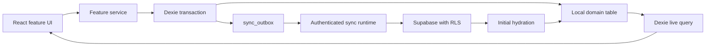

# Current Architecture

This document maps the architecture implemented in the repository today. It describes how the pieces fit together; it is not a roadmap or a substitute for the rationale preserved in [architecture decision records](./adr/). When this guide and the code disagree, the code and schema are authoritative and this guide must be corrected.

## System Overview

EV Analytics is a client-rendered React PWA with an offline-first data path. Dexie/IndexedDB is the application's operational data store, while Supabase provides authentication and private remote persistence. An authenticated sync runtime hydrates selected remote tables into Dexie and replays locally queued mutations to Supabase.

Hosting is intentionally separate from the data architecture. Vite builds the SPA and Wrangler deploys it as Cloudflare Workers static assets, as recorded in [ADR 007](./adr/007-cloudflare-workers-static-assets.md).

## Code Ownership and Dependencies

The repository uses four application layers:

| Layer | Owns | May depend on |
| --- | --- | --- |
| `src/app` | Application shell, authentication gating, top-level navigation, feature composition, and sync-runtime lifecycle | Feature public APIs, shared UI, and infrastructure types needed for composition |
| `src/features/<domain>` | Domain UI, hooks, models, validation, and workflows | Its own internals, `shared`, approved `infra` interfaces, and another feature's public `index.ts` API |
| `src/shared` | Domain-agnostic UI primitives and pure utilities | Other shared modules and platform/library APIs; never features |
| `src/infra` | Dexie schema, Supabase client, and mock adapters | Platform/library APIs; never features |

ESLint enforces the feature/shared/infra import boundaries in [`eslint.config.js`](../eslint.config.js). Cross-feature consumers must use the target feature's `index.ts`, which keeps each feature's internal components, hooks, services, and models private by default.

A representative dependency path is the Analytics flow:

1. [`AnalyticsPage`](../src/features/analytics/components/AnalyticsPage.tsx) calls the analytics hook.
2. [`useMonthlySessionSpend`](../src/features/analytics/hooks/useMonthlySessionSpend.ts) imports `useSessions` through the `charging-sessions` feature API.
3. [`useSessions`](../src/features/charging-sessions/hooks/useSessions.ts) reads through the charging-session service and subscribes with Dexie `useLiveQuery`.
4. The service depends on the database types and tables exported by [`src/infra/db`](../src/infra/db/index.ts).

The app shell may compose and lazy-load feature UI. Domain behavior remains inside feature services rather than moving into `src/app`.

## Local Write Path

User-visible mutations are local-first:

1. A form or application action invokes a feature service.
2. The service validates and prepares the domain record, including ownership, timestamps, soft-delete state, and pricing snapshots where applicable.
3. A single Dexie transaction writes the domain table and a complete replay payload to `sync_outbox`. Session saves can update `sessions`, `provider_plan_selections`, and their outbox entries in the same transaction.
4. Dexie commits locally without waiting for connectivity. Hooks backed by `useLiveQuery` react to the committed local state, so the UI updates immediately and can mark pending session rows from the outbox.
5. The sync runtime subscribes to committed outbox insertions and requests an outbox pass after the transaction completes.
6. The sync engine replays ready payloads to Supabase with idempotent upserts. It removes an outbox row only after Supabase accepts it.

Deletes are soft deletes: services set `deleted_at`, store the changed row locally, and queue the full payload. Active queries filter those rows out while the deletion marker remains available for remote replay.

This is “optimistic” from the user's perspective because remote persistence is deferred, but the UI observes a successful local commit rather than an uncommitted in-memory guess. The authoritative implementation is in the [charging-session service](../src/features/charging-sessions/services/sessionService.ts), [charging-plan service](../src/features/charging-plans/services/planService.ts), and [provider service](../src/features/charging-plans/services/providerService.ts).

## Reads, Hydration, and Reconciliation

### Local reads

Domain screens read from Dexie. Feature hooks scope records to the authenticated `user_id`, omit soft-deleted rows, and use `useLiveQuery` where the UI must react to local writes or hydration. Analytics consumes the same local session stream, so it remains available offline and includes unsynchronized local sessions.

### Authenticated synchronization

[`App`](../src/app/App.tsx) starts the sync runtime only for an authenticated user. The runtime:

- performs initial hydration once per authenticated runtime;
- processes the outbox after hydration;
- requests additional passes after browser `online` events and committed outbox insertions; and
- coalesces overlapping triggers so only one pass runs at a time.

Runtime disposal aborts later synchronization phases and local bookkeeping after asynchronous boundaries. Sign-out waits for the disposed runtime's active pass to quiesce before atomically clearing local user data, so a delayed hydration response cannot repopulate Dexie after logout cleanup.

Initial hydration pulls `providers`, `charging_plans`, and remote `charging_sessions`, then bulk-upserts them into the corresponding local tables. Remote session rows are validated against the plan/ad-hoc mode contract before any session batch is written. Pull, validation, and write failures are isolated per table. Hydration does not clear local tables or the outbox first.

The current reconciliation model is deliberately simple: remote hydration uses primary-key upserts, then queued local payloads replay to Supabase. There is no general multi-writer merge algorithm. A pending outbox payload survives hydration, but a remote row with the same ID can temporarily replace its local domain row until replay or another local write occurs. The private, single-user product posture limits this trade-off.

`provider_plan_selections` can be written locally and replayed remotely, but the current initial hydration does not pull that table. Charging sessions retain selection identifiers and immutable price/name snapshots needed for historical rendering. This limitation and retry behavior are documented in [ADR 005](./adr/005-outbox-sync-strategy.md).

### Retry and failure behavior

Outbox processing considers ready entries oldest-first. Retryable failures retain the entry and record retry count, last attempt, next eligible attempt, and the last error. Backoff starts at one minute and caps at fifteen minutes. A future runtime trigger—not a dedicated timer—starts the next eligible pass.

Database constraint failures are non-retryable. Charging-plan overlap conflicts remain queued for user resolution but are treated as item-local so later ready work can continue. Other blocking failures stop the current pass to avoid replaying dependent writes out of order.

### Sign-out isolation

After successful Supabase sign-out, [`clearLocalUserData`](../src/infra/db/db.ts) clears all domain tables and the outbox in one Dexie transaction. This prevents data from one account remaining visible to another account using the same browser profile. The auth flow is implemented in [`useAuth`](../src/features/auth/hooks/useAuth.tsx).

## Data Model

The canonical local model and Dexie versions live in [`src/infra/db/db.ts`](../src/infra/db/db.ts). The canonical clean-import remote schema, constraints, indexes, foreign keys, and RLS policies live in [`supabase/schema.sql`](../supabase/schema.sql). Do not duplicate those complete definitions in documentation.

| Concept | Local Dexie | Remote Supabase | Important behavior |
| --- | --- | --- | --- |
| Provider | `providers` | `providers` | User-owned, unique active name, soft-deleted |
| Charging plan version | `charging_plans` | `charging_plans` | Date-bounded pricing version; remote schema prevents overlapping active versions for the same user/provider/name |
| Provider plan selection | `provider_plan_selections` | `provider_plan_selections` | Validity history with a price snapshot; replayed by the outbox but not initially hydrated |
| Charging session | `sessions` | `charging_sessions` | Plan session linked to a saved provider and plan, or unlinked ad-hoc session with billing-provider, optional CPO, and price snapshots |
| Pending mutation | `sync_outbox` | None | Local-only durable replay queue with action, payload, timestamps, retry metadata, and error state |

Shared UUIDs identify the same domain rows locally and remotely. Supabase RLS restricts every remote domain table to `auth.uid() = user_id`, as recorded in [ADR 004](./adr/004-supabase-auth-and-rls.md).

Charging sessions use a mode-discriminated identity contract. Plan sessions require a saved `provider_id` and `tariff_plan_id` and cannot carry ad-hoc pricing. Ad-hoc sessions require `provider_id`, `tariff_plan_id`, and `plan_selection_id` to be null; their nonblank `provider_name_snapshot` is the billing provider, while `ad_hoc_pricing.cpoName` is optional charging-station-operator context. Saving an ad-hoc session does not create a provider, charging plan, or plan-selection row. The mode/linkage invariant is represented by the local discriminated union, validated during remote hydration, and enforced by Supabase constraints.

Money values, including session totals and per-kWh prices, are integer cents. Energy values are decimal kWh. Timestamps are stored as UTC-capable instants; charging-plan validity uses date values. Optional measurements remain absent when unknown rather than being converted to zero. Session pricing snapshots preserve historical display and calculation inputs even when plans later change or are deleted; see [ADR 006](./adr/006-tariff-snapshots.md).

## Analytics Semantics

The current Analytics slice is calculated in the browser from local charging sessions. [`useMonthlySessionSpend`](../src/features/analytics/hooks/useMonthlySessionSpend.ts) consumes `useSessions`, and [`calculateMonthlySessionSpend`](../src/features/analytics/model/monthlySessionSpend.ts) performs the aggregation.

The rules are intentionally narrow:

- A selected month is a user-facing local calendar month. [`createMonthPeriod`](../src/features/analytics/model/analyticsPeriods.ts) constructs local-midnight boundaries as absolute instants, and session timestamps are included with an inclusive start and exclusive end.
- Soft-deleted sessions are excluded. The session query filters them, and the aggregation defensively excludes them again.
- Monthly session spend is the sum of each included session's snapshotted `total_cost`, which is already stored in integer cents. The aggregation does not independently add monthly plan fees or recalculate historical prices from current plans.
- Billed energy uses `kwh_billed`, meaning energy reported by the charging provider. It is not interchangeable with optional `kwh_added`, which represents energy added to the battery.
- Only finite, positive billed-energy values contribute to the energy total. If no included session has a valid billed value, billed energy is unavailable (`null`), not zero. The result records how many sessions supplied valid billed energy so partial coverage can be disclosed.
- The page refreshes its notion of “current month” at local midnight so month navigation and completion labels do not become stale while the page remains open.

### Lifetime Overall Price

[`useOverallChargingPrice`](../src/features/analytics/hooks/useOverallChargingPrice.ts)
combines the same live local session stream with the scoped charging-plan
history needed for fixed costs. It is lifetime-scoped rather than driven by the
month selector, remains available offline, and follows the split authority in
[ADR 008](./adr/008-overall-price-fixed-cost-authority.md).

- Active sessions contribute their stored `total_cost` and provider-billed
  `kwh_billed`. Every active session must have finite, positive billed energy
  or the lifetime KPI is unavailable; this is stricter than the monthly
  partial-coverage rule above.
- Ad-hoc sessions contribute session spend and billed energy but never qualify
  a tariff fee. A plan session qualifies its logical tariff in that local
  calendar month.
- Applicable fees use the relevant charging-plan version history, including
  referenced soft-deleted versions. They are prorated by active calendar days,
  stop at the current local day, and round once after all lifetime fee
  contributions are accumulated.
- The final rate divides included spend by total provider-billed energy.
  Missing referenced history or conflicting qualifying paid tariffs returns an
  unavailable KPI instead of a partial price.

Local mock-mode browser checks can set `VITE_ENABLE_MOCKS=true` and
`VITE_MOCK_ANALYTICS_SCENARIO` to `ready`, `empty`, `missing-history`, or
`overlap`. Clear the `EVAnalyticsDB` IndexedDB database before changing the
scenario, because hydration upserts returned rows but does not delete rows
omitted by a later fixture.

## Security, Hosting, and Operational Sources

- Authentication and remote ownership: [ADR 004](./adr/004-supabase-auth-and-rls.md)
- Offline storage: [ADR 002](./adr/002-dexie-offline-first.md)
- Outbox synchronization: [ADR 005](./adr/005-outbox-sync-strategy.md)
- Session pricing snapshots: [ADR 006](./adr/006-tariff-snapshots.md)
- Overall Price fixed-cost authority: [ADR 008](./adr/008-overall-price-fixed-cost-authority.md)
- Cloudflare hosting: [ADR 007](./adr/007-cloudflare-workers-static-assets.md)
- Environment provisioning and deployment: [infrastructure runbook](./infrastructure-runbook.md)

## Updating This Guide

Update this guide when implemented data flow, ownership boundaries, persistence tables, synchronization behavior, or analytics semantics change. Record why a significant architectural choice changed in an ADR; keep this guide focused on what the system does now.
